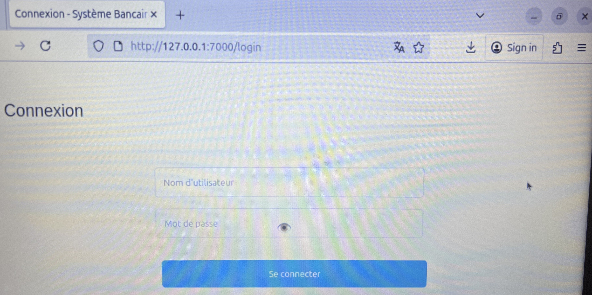
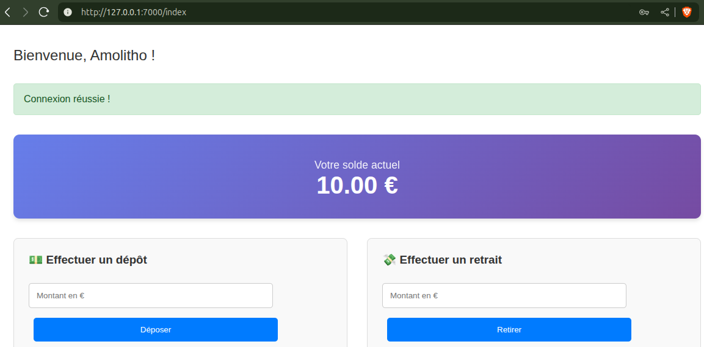
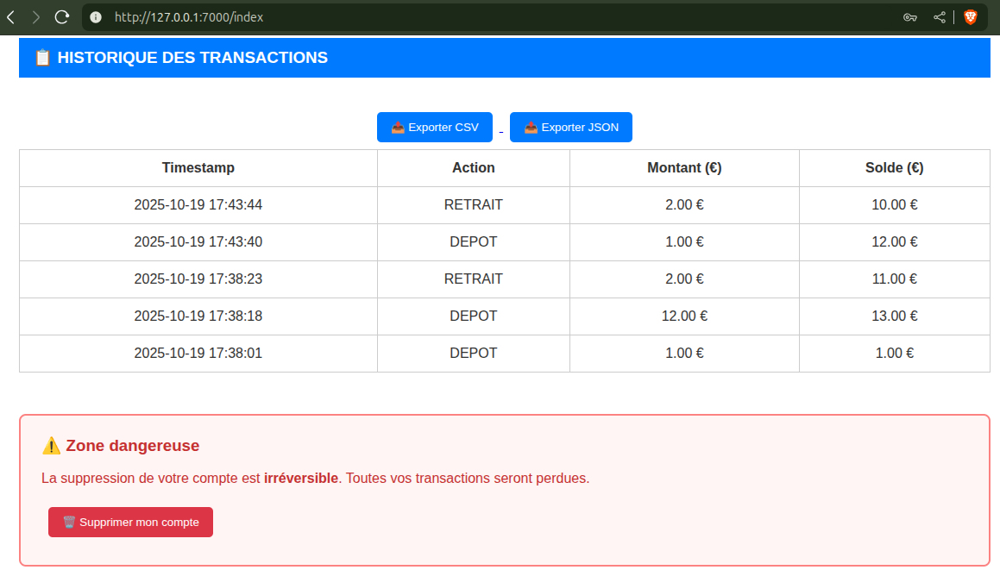
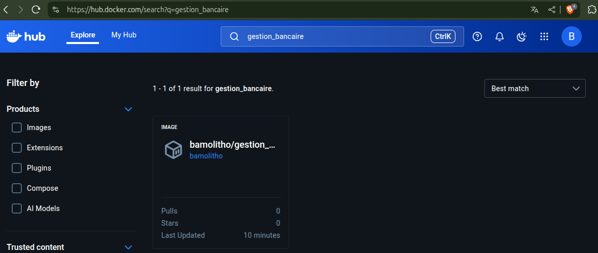

# SYSTÈME DE GESTION BANCAIRE AVEC DOCKER

[TOC]

## 1. Objectifs

**Application bancaire containérisé qui permet à un utilisateur de :** 

- créer un compte, 
- consulter son compte,
- effacer son compte, 
- déposer de l'argent, 
- retirer de l'argent. 

**Un compte est associé aux caractéristique suivant :** 

   - Un id unique de 6 chiffres (généré par le système),
   - Un username,
   - un mot de passe (choisi par l'usager)


# GUIDE USAGERS

## 2. Installation et lancement à partir des scripts

### 2.1 Prérequis

- Docker 

### 2.2 Installation

J'ai mis toutes les instructions nécessaires dans le script [run_gestion_bancaire.sh](./run_gestion_bancaire.sh) . Il suffit juste de l’exécuter pour : 

-  Créer l'image à partir du [Dockerfile](./Dockerfile) si elle n'existe pas déjà,
- Créer un conteneur à partir de l'image,
- Vérifier la santé du conteneur (healthy ou non),
- Ouvrir le navigateur par défaut automatiquement à l'adresse http://127.0.0.1:7000/login

Par défaut, le service est joignable via l'adresse IP locale 127.0.0.1 et sur le port 7000. L'application tourne derrière le port 6000 à l'intérieur du conteneur.

```shell
# 1. Donner les droits d'execution au script "run_gestion_bancaire.sh"
chmod +x run_gestion_bancaire.sh
# 2. Lancer le script
./run_gestion_bancaire.sh
```

## 3. Télécharger l'image sur docker hub et construire un conteneur depuis une autre machine

### 3.1 Prérequis

- Docker 

**[ÉTAPE 1] Se connecter à son compte docker**

```shell
Amomo@amomo-vm-w:~$ sudo docker login -u username
```

**La sortie attendue est la suivante :**

```shell
i Info → A Personal Access Token (PAT) can be used instead.
         To create a PAT, visit https://app.docker.com/settings
         
         
Password: # Mettre token d'accès ici

WARNING! Your credentials are stored unencrypted in '/root/.docker/config.json'.
Configure a credential helper to remove this warning. See
https://docs.docker.com/go/credential-store/

Login Succeeded
```

**[ÉTAPE 2] Télégarcher l'image via pull**

```shell
Amomo@amomo-vm-w:~$ sudo docker pull bamolitho/gestion_bancaire:1.0
```

**Sortie attendue** (qqch de cette forme) : 

```less
1.0: Pulling from bamolitho/gestion_bancaire
8c7716127147: Downloading  21.72MB/29.78MB
8c7716127147: Pull complete 
c72c56726626: Pull complete 
d388ad611dd5: Pull complete 
50942d41387a: Pull complete 
3c3977e53b80: Pull complete 
df25555a61ea: Pull complete 
d3a6351426a4: Pull complete 
6bc3240c54da: Pull complete 
e24102a84273: Pull complete 
633b300b6782: Pull complete 
Digest: sha256:00302e63c568ddedda6f328acd7648f36bb11083c8d42c2c7513633a3abe57d3
Status: Downloaded newer image for bamolitho/gestion_bancaire:1.0
docker.io/bamolitho/gestion_bancaire:1.0
```

**[ÉTAPE 2.1] Vérifier que l'image est présente** 

```shell
Amomo@amomo-vm-w:~$ sudo docker images
```

**Sortie attendue** (qqch de cette forme) : 

```less
REPOSITORY                                      TAG       IMAGE ID       CREATED       SIZE
bamolitho/gestion_bancaire                      1.0       0e4d5ca1b6e5   2 hours ago   161MB
```

**[ÉTAPE 3] Créer le conteneur à partir de l'image téléchargé**

```shell
Amomo@amomo-vm-w:~$ sudo docker run -d -p 7000:6000 --name gestion_bancaire bamolitho/gestion_bancaire:1.0
```

**Sortie attendue** (qqch de cette forme) : 

```less
8bb27b80d10b3aa3252caa39c1fcc6e6c7f3c664b244836114a5dca1d239aa5f
```

**[ÉTAPE 3.1] Vérifier que le conteneur tourne et a un status healthy**

```shell
Amomo@amomo-vm-w:~$ sudo docker ps
```

Sortie attendue (qqch de cette forme) : 

```less
CONTAINER ID   IMAGE                                                  COMMAND                  CREATED          STATUS                         PORTS                                                   NAMES
8bb27b80d10b   bamolitho/gestion_bancaire:1.0                         "python web/app.py"      57 seconds ago   Up 55 seconds (healthy)        0.0.0.0:7000->6000/tcp, [::]:7000->6000/tcp             gestion_bancaire
```

**[ÉTAPE 4] Tester la connexion en ligne de commande**

```shell
curl http://127.0.0.1:7000/login
```

**Sortie attendue** : Une page html sur le terminal

**[ÉTAPE 5] Ouvrir l'application depuis un navigateur**

```basic
http://127.0.0.1:7000
```



**[ÉTAPE 6] Créer un compte et prendre des actions (dépôts, retraits, exports csv, etc.)**

## 4. Utilisation

Une fois arrivé sur la page login, il faut créer un compte en mettant un "username" et un "mot de passe". Une fois le compte créé, vous pourrez prendre des actions comme : 

**Effectuer un dépôt ou un retrait**



**Visualiser l'historique des transactions ou supprimer le compte**



# CE QUE J'AI FAIT ET DANS QUEL ORDRE

## 5. Technologies utilisées

- **SQLite** : base de données pour stocker les infos principales,
- HTML / CSS / JS  pour créer une interface web,
- Flask : créer une API pour la communication entre le backend et le frontend. 

## 6. Pipeline suivi


## 7. Conteneurisation : étapes et resultats

###### 7.1 Créer l'image à partir du Dockerfile : *sudo docker build -t <imageName:tag>*

```bash
amolitho@amolitho:~/../containerized-banking-system$ sudo docker build -t gestion_bancaire:1.0 .

[+] Building 1.6s (13/13) FINISHED                                                                                 docker:default
 => [internal] load build definition from Dockerfile                                                                         0.0s
 => => transferring dockerfile: 1.05kB                                                                                       0.0s
 => [internal] load metadata for docker.io/library/python:3.10-slim                                                          1.4s
 => [auth] library/python:pull token for registry-1.docker.io                                                                0.0s
 => [internal] load .dockerignore                                                                                            0.0s
 => => transferring context: 83B                                                                                             0.0s
 => [1/7] FROM docker.io/library/python:3.10-slim@sha256:621488956f7e14ca249420e37dbecd59f669a8776bef0429aa89a4ebd8c6de9e    0.0s
 => [internal] load build context                                                                                            0.0s
 => => transferring context: 12.68kB                                                                                         0.0s
 => CACHED [2/7] WORKDIR /app                                                                                                0.0s
 => CACHED [3/7] RUN apt-get update && apt-get install -y curl && rm -rf /var/lib/apt/lists/*                                0.0s
 => CACHED [4/7] RUN useradd -m appuser                                                                                      0.0s
 => CACHED [5/7] COPY requirements.txt .                                                                                     0.0s
 => CACHED [6/7] RUN pip install --no-cache-dir --upgrade pip &&     pip install --no-cache-dir -r requirements.txt          0.0s
 => [7/7] COPY . .                                                                                                           0.0s
 => exporting to image                                                                                                       0.0s
 => => exporting layers                                                                                                      0.0s
 => => writing image sha256:0e4d5ca1b6e547a9d81038fb8521a5ebe5754e1eb94d313c116adcb6ed8bbb53                                 0.0s
 => => naming to docker.io/library/gestion_bancaire:1.0                                                                      0.0s
```

###### 7.2 Lancer un conteneur à partir de l'image créée : *sudo docker run -d -p <port_hote>:<port_conteneur> --name <custom_name> <imageName:tag>*

```bash
amolitho@amolitho:~/../containerized-banking-system$ sudo docker run -d -p 7000:6000 --name gestion_bancaire gestion_bancaire:1.0

b89de42b5466396362cbc86d129afc5f745d10f71eaf239b1eab9e6e7b47070f

```

Ça retourne l'identifiant du conteneur (Container ID).

###### 7.3 Vérifier que le conteneur tourne : *sudo docker ps*

```bash
amolitho@amolitho:~/../containerized-banking-system$ sudo docker ps
CONTAINER ID   IMAGE                  COMMAND               CREATED          STATUS                    PORTS                                         NAMES
b89de42b5466   gestion_bancaire:1.0   "python web/app.py"   11 seconds ago   Up 10 seconds (healthy)   0.0.0.0:7000->6000/tcp, [::]:7000->6000/tcp   gestion_bancaire
```

###### 7.4 Tagger l'image et la pousser sur docker hub  

```bash
# 0. Se connecter à docker hub
sudo docker login -u <userName>

# 1. Tagger l'image
sudo docker tag gestion_bancaire:1.0 bamolitho/gestion_bancaire:1.0

# 2. Vérifier que l'image existe
amolitho@amolitho:~/../containerized-banking-system$ sudo docker images
REPOSITORY                   TAG           IMAGE ID       CREATED             SIZE
bamolitho/gestion_bancaire   1.0           0e4d5ca1b6e5   19 minutes ago      161MB

# 3. Pousser l'image sur docker
amolitho@amolitho:~/../containerized-banking-system$ sudo docker push bamolitho/gestion_bancaire:1.0
The push refers to repository [docker.io/bamolitho/gestion_bancaire]
ec4c6ba8be42: Pushed 
f2fb49b6faa3: Pushed 
5f33ddd2a2eb: Pushed 
70d8e90a6f50: Pushed 
fe8ce0be5ad3: Pushed 
8322816c4a4c: Pushed 
92368030d776: Mounted from library/python 
412f302fac32: Mounted from library/python 
c9cf0647c388: Mounted from library/python 
1d46119d249f: Mounted from library/python 
1.0: digest: sha256:00302e63c568ddedda6f328acd7648f36bb11083c8d42c2c7513633a3abe57d3 size: 2411
```

###### 7.5 Vérifier que l'image existe sur docker hub



# AVANTAGES DE DOCKER

| **Élément**           | **Avec Docker**             |
| --------------------- | --------------------------- |
| Configuration serveur | Automatique via conteneur   |
| Dépendances           | Incluses dans le conteneur  |
| Déploiement           | Rapide et identique partout |
| Reproductibilité      | Ça marche partout           |

# RÉFÉRENCES

###### **Scripts et logique web** : https://github.com/Bamolitho/phishing-detection-ml/tree/main

###### **Docker** : https://github.com/Bamolitho/InsideDocker